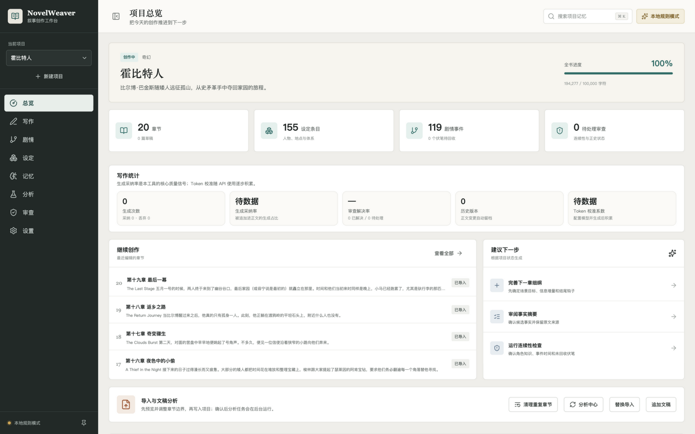
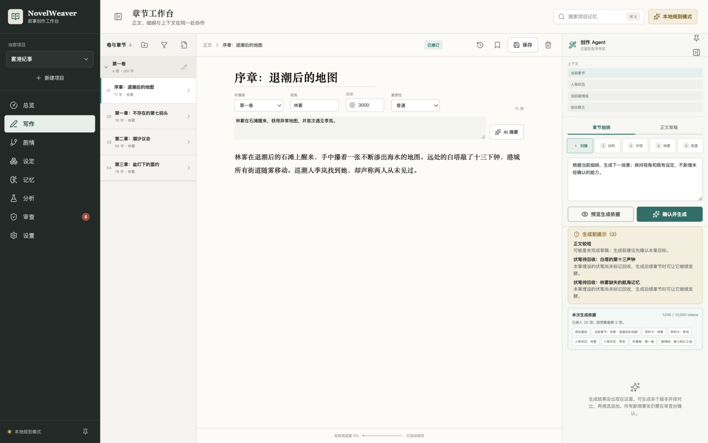
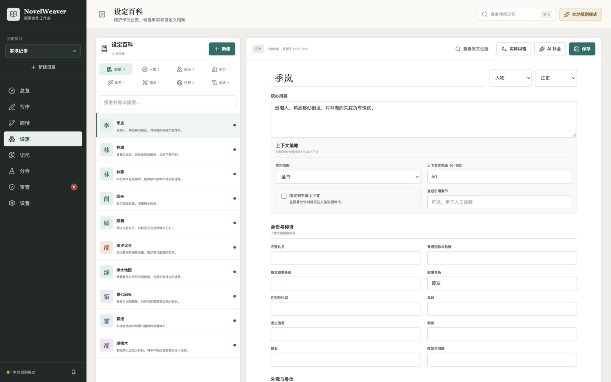
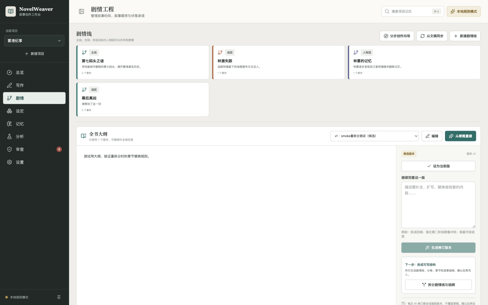
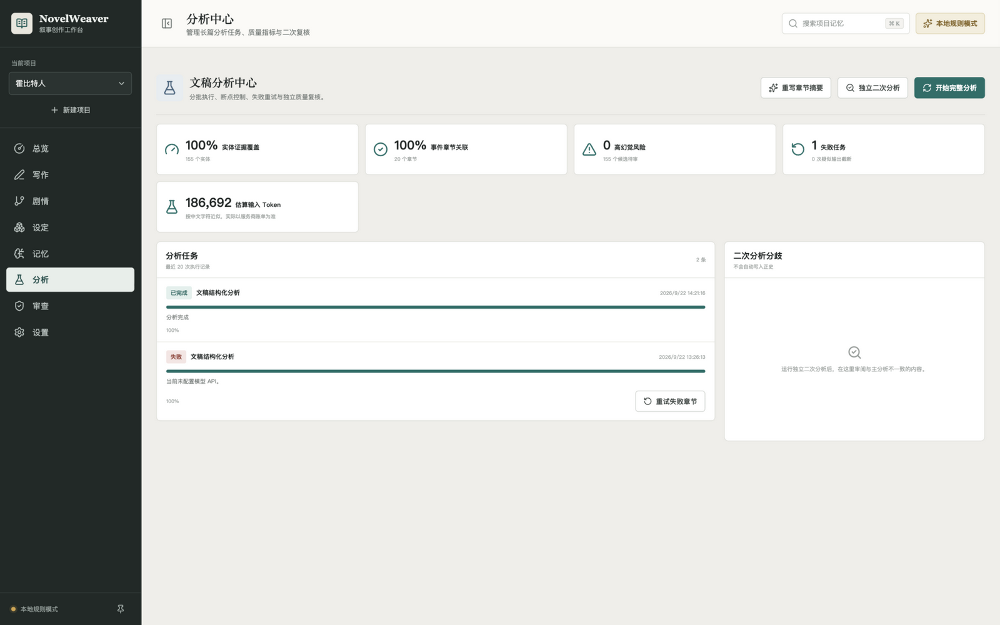

# NovelWeaver · 本地优先的小说创作 Agent 工作台

<p align="center">
  
  
  
  
  
  
</p>

> 一个把 **长篇小说写作流** 搬进本地工作台的 AI 应用：文稿导入 → 结构化分析 → 分层记忆检索 → 流式生成 → 连续性审查 → 稿件导出，全流程可离线运行；接入任意 OpenAI 兼容 API 后获得完整模型能力。
>
> 与同类工具最大的不同：**AI 产出永远只是候选，正史必须由作者显式确认**；并用一套可复现的评测体系（金标准 + 基线 + 回归门）来度量检索与提取质量，而不是"看起来能用"。

## 界面预览

| | |
|---|---|
|  |  |
| **项目总览**：进度、写作统计、采纳率、Token 校准 | **三栏写作台**：正文 · 细纲 · 创作 Agent（上下文报告 + 生成前预检） |
|  |  |
| **世界设定**：八类实体档案、候选/正史状态流转 | **剧情板**：全书大纲版本、剧情线、事件时间轴、伏笔生命周期 |
|  | |
| **分析中心**：分批分析任务、证据覆盖率、幻觉风险、二次复核 | |

## 核心亮点

### 1. AI 幻觉治理：候选-正史工作流
模型提取的人物、地点、事件一律进入 `candidate` 状态，证据覆盖率、低置信度与幻觉风险由规则量化（霍比特人项目：155 个候选实体，高幻觉风险 **0**）；只有作者显式确认才进入正史。无 API Key 时使用确定性本地规则，**不猜专名、不伪装智能**。

### 2. 分层记忆检索 + 上下文预算
SQLite FTS5（trigram 中文子串）+ LIKE 兜底 + bm25 + 实体别名扩展 + 章节距离衰减的混合检索；上下文组装按优先级装填 token 预算并输出裁剪报告。人物状态卡由事件序列确定性推演（最近事件/时间/位置），抑制角色"提前知情"。

### 3. 可复现的评测体系（本项目的差异化重点）
- **双语料金标准**：32 条检索查询（种子语料 14 条可任意复现 + 《首无》18 条真实语料，人物关系类要求双实体同块共现）
- **基线锁定 + 回归门**：`pnpm eval` 出报告，指标劣化超过 2pp 测试即失败
- **设定提取评测**：29 条 ground truth（译名对照正文校准），霍比特人全量分析后 **GT 召回率 100%**
- **审查规则金丝雀**：预埋全部已知违规类型，规则弱化即测试失败
- **行为指标埋点**：生成采纳率（追加/丢弃）、真实 token `usage` 采集用于校准估算器
- **检索对照实验 → 门控落地**（GLM-Embedding-3，524 块真实语料，见 `eval/reports/`）：实体名锚定查询上词法混合基线全面胜出（Recall@8 100% vs 纯向量 94% vs RRF 融合 83%）；不含实体名的改述查询上纯向量反超（100% vs 89%）。据实验结论实现**查询形态门控检索**：含已知实体名走词法混合，否则走向量语义召回（向量后台增量回填，未配置/覆盖率不足/接口失败均静默回落词法）——生产回测改述查询 Recall@8 89% → **100%**，实体名查询保持 100%
- **检索降噪**（IDF 词重加权 + 实体共现加成，见 `eval/reports/denoising-experiment-2026-10-07.md`）：逐块噪声构成分析定位两类成因（单实体挤占 80%、泛化二字词误抬），确定性离线修复后真实语料 Top-8 疑似噪声率 34% → **20%**，MRR 0.80 → **0.96**，泛化词噪声清零，Recall 保持 100%

| 指标 | 雾港纪事（种子语料） | 首无（22 万字真实语料） | 霍比特人（19 万字） |
|---|---|---|---|
| 检索 Recall@8 | 100% | 100% | — |
| 检索 MRR | 0.946 | 0.963 | — |
| Top-8 疑似噪声率 | 34.8% | 20.1% | — |
| 章节切分 | — | 26 章 | 20 章，0 空章 |
| 设定提取 GT 召回 | — | — | **100%（29/29）** |
| 证据覆盖率 | — | — | **100%** |

### 4. 面向长文的工程细节
- **自适应分批分析**：18k 字符分批 → 解析失败对半重试 → 精简字段兜底，配合多层 JSON 修复（`<think>` 剥离 / 代码块提取 / 括号配平 / jsonrepair）
- **流式生成**：SSE 逐字渲染，最多 3 个版本并排对比、择一采纳（自动剥离 `[R1]` 引用标记）
- **生成前预检**：缺视角、事件缺时间、本章伏笔未回收等规则提示，写前发现问题而非事后补救
- **写作安全网**：停笔 2.5s 自动保存、章节历史版本（50 份可恢复）、每 12h 项目全量快照
- **稿件导出**：TXT / Markdown / DOCX（手写 OOXML）/ EPUB（手写最小 EPUB 3 包）

## 架构

```text
React 19 + Vite（路由懒加载分包）
        │ /api（SSE / REST）
        ▼
Express 5 ── routes/ 按域拆分：projects · chapters · world · story · ingest · generate · stats
        │                        helpers（事务/共享逻辑） · analysis-service（任务调度）
        ▼
SQLite + FTS5（WAL、外键级联、双 FTS 表 + 触发器）
        │
        ├── importer    TXT/MD/DOCX/EPUB/PDF → 预览-提交两阶段导入 → 分块索引
        ├── analyzer    模型结构化抽取（zod 校验 + 自适应分批 + JSON 修复）→ 候选池
        ├── memory      混合检索 + 人物状态推演 + 上下文组装（token 预算 + 裁剪报告）
        ├── planner     大纲 → 剧情线/分卷/逐章细纲（重拆分时自动清理空白规划章）
        ├── review      规则连续性审查 + 单章生成前预检
        ├── exporter    TXT / MD / DOCX / EPUB
        └── backup      全量快照 + 保留策略

模型层：OpenAI 兼容网关（usage 采集 / 错误诊断 / 推理模型兼容），无 Key 时降级为确定性本地规则
```

## 快速开始

```bash
pnpm install
pnpm dev            # http://localhost:5173（API 4300，内置"雾港纪事"演示项目）
pnpm test           # 51 个单测 / API / 评测测试
pnpm eval           # 检索评测报告；pnpm eval:baseline 锁基线
pnpm eval:extraction  # 霍比特人切分校验 + 提取对照
pnpm build && pnpm start   # 生产模式（默认只监听 127.0.0.1）
```

无 API Key 即可体验导入、检索、规则审查、导出与本地生成；`eval/` 目录包含全部评测资产（金标准、Canary、基线），评测不依赖任何外部服务。

## 模型接入

两种方式（密钥刻意不持久化，生产请用环境变量）：

1. 设置页"模型网关"填 Base URL / 模型名 / Key（仅保存在当前服务进程内存）；
2. `.env` 配置 `AI_BASE_URL`、`AI_API_KEY`、`AI_MODEL`（Base URL 只需到 `/v1`）。

已在 DeepSeek-V4.1-Flash（含推理模型）上完整验证：20 章全量分析、流式生成、摘要重写。

## 项目结构

```text
server/            Express 应用（routes/ 按域拆分）+ importer/analyzer/memory/planner/review/exporter/backup
src/               React 工作台（9 个页面 + 三栏写作台）
eval/              金标准 · 提取 ground truth · 基线 · 回归门 · 审查金丝雀 · 内部分析脚本
docs/              架构说明与界面截图
.data/             SQLite 数据库与备份（gitignore）
```

## 当前边界

- 单机单用户，无鉴权（默认只监听回环地址）；检索为词法混合 + 查询形态门控向量召回（未配置 Embedding 或覆盖率不足时静默回落词法），重排器与"候选事实差异"提取器为预留边界，基线已锁定、升级后可直接对照
- 多人协作与发布同步不在范围内；数据全量可导出为 JSON

详细模块说明见 [docs/ARCHITECTURE.md](docs/ARCHITECTURE.md)。
