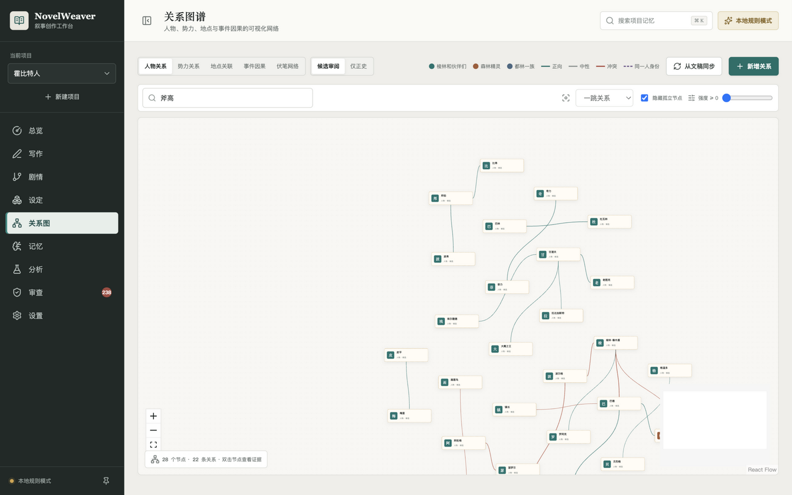

<h1 align="center">NovelWeaver</h1>

<p align="center">
  <b>本地优先的长篇小说创作 Agent 工作台 · A Local-First AI Workbench for Long-Form Novel Writing</b>
</p>

<p align="center">
  
  
  
  
  
  
  
</p>

## ⚡ 概览

> 你只需要：导入一份文稿（或从零开始构思），用自然语言描述这一章想写什么。
>
> NovelWeaver 会返回：**带证据引用的可追溯草稿**、一个随写作演进的**结构化正史数据库**，以及一套**每次提交都在跑的质量回归门**——而不是一段看起来能用、却无法验证的文本。

- **本地优先**：全部创作数据存于本地 SQLite，无 Key 也能离线运行完整链路；API Key 刻意不持久化
- **可追溯**：AI 产出永远只是候选，正史必须由作者显式确认；每个事实结论都挂着 `[Rn]` 证据引用，悬停即见原文
- **可度量**：检索、提取、审查、生成四条评测线全部金标准 + 基线锁定 + 回归门，指标劣化超过 2pp 测试即失败

## 🔄 创作工作流

1. **导入建库**：TXT / Markdown / DOCX / EPUB / PDF → 预览-提交两阶段导入（可合并/拆分/改标题）→ 章节切分与分块索引
2. **结构化分析**：模型抽取人物、地点、事件、关系、剧情线 → 经 zod 校验与多层 JSON 修复进入候选池，证据覆盖率与幻觉风险规则量化
3. **上下文记忆**：分层记忆检索（词法/向量门控）+ 全书宏观记忆 + 人物状态推演 → 按 token 预算组装上下文快照
4. **剧情推演**：全书大纲版本管理 → 一键拆分剧情线/分卷/逐章细纲 → 事件时间轴与伏笔生命周期跟踪
5. **生成与采纳**：流式生成多版本并排对比 → 采纳即自动保存并做预检前后对比 → 连续性审查与事实冲突裁决
6. **导出归档**：TXT / Markdown / DOCX / EPUB 稿件 + 全量 JSON 备份

## 📸 界面预览

| | |
|---|---|
|  |  |
| **项目总览**：进度、写作统计、采纳率、Token 校准 | **三栏写作台**：正文 · 细纲 · 创作 Agent（上下文报告 + 生成前预检） |
|  |  |
| **世界设定**：八类实体档案、候选/正史状态流转 | **剧情板**：全书大纲版本、剧情线、事件时间轴、伏笔生命周期 |
|  |  |
| **关系图谱**：人物/势力/地点/事件因果/伏笔网络，家族分簇着色 | **分析中心**：分批分析任务、证据覆盖率、幻觉风险、二次复核 |

## ✨ 核心亮点

### 🧠 上下文记忆系统

生成时模型只看到一份确定性组装的上下文快照——快照质量决定生成质量，因此这里是本项目打磨最深的部分：

- **混合检索**：SQLite FTS5（trigram 中文子串）+ LIKE 兜底 + bm25 加权 + 实体别名扩展 + 章节距离衰减，全部离线可用
- **查询形态门控**：对照实验（GLM-Embedding-3，524 块真实语料）表明实体名锚定查询词法胜出、改述查询向量反超，据此实现 either/or 门控——含已知实体名走词法混合，否则走向量语义召回（后台增量回填，未配置/覆盖率不足/接口失败均静默回落词法）。生产回测：改述查询 Recall@8 89% → **100%**
- **检索降噪**：逐块噪声构成分析定位两类成因（单实体挤占 80%、泛化二字词误抬），IDF 词重加权 + 实体共现加成确定性修复——真实语料 Top-8 疑似噪声率 34% → **20%**、MRR 0.80 → **0.96**，Recall 保持 100%
- **全书宏观记忆**：卷结构、未回收伏笔、体量进度按结构化数据确定性拼装注入每次生成——超长作品"越写越散"的解药，零幻觉风险
- **人物状态推演**：由事件序列确定性推演"此刻谁知道什么、在哪"，抑制角色提前知情
- **token 预算装填**：按优先级装填 10k 预算并输出裁剪报告，写进每条生成记录

### 🎭 剧情推演与连续性引擎

- **大纲版本管理**：AI 每次修订创建新版本不覆盖原稿，作者确认后设为当前版；一键拆分为剧情线、分卷与逐章细纲（重拆分自动清理空白规划章）
- **伏笔生命周期**：埋设 → 强化 → 回收状态流转，未回收伏笔进生成前预检，也会注入宏观记忆提醒后续章节
- **生成前预检**：缺视角、事件缺故事时间、本章伏笔未回收等规则提示——写前发现问题而非事后补救；采纳生成内容后自动做预检前后对比，"这次生成引入了几个新问题"变成即时反馈
- **连续性审查 + 事实冲突提取器**：规则引擎检查正史状态、时间线、人物参与；候选事实与正史同口径冲突自动进审查队列（高危），作者一键裁决或驳回
- **关系图谱**：人物关系 / 势力关系 / 地点关联 / 事件因果 / 伏笔网络五种视图；家族分簇着色布局、平行关系扇出、四向锚点布线；双击节点直达原文证据

### 🛡️ AI 幻觉治理：候选-正史工作流

模型提取的实体、事件一律进入 `candidate` 状态，只有作者显式确认才进入正史（霍比特人项目：155 个候选实体，高幻觉风险 **0**）。生成侧按系统提示词的生成契约做接地评测——引用有效率（`[Rn]` 必须指向上下文快照中真实证据）、引用覆盖率、数字接地率（排除列表序号与中文序数）、完整度，前端引用芯片悬停显示证据原文、越界编号直接标注"可疑引用"。无 API Key 时降级为确定性本地规则，**不猜专名、不伪装智能**。

### 📏 可复现的评测体系（本项目的差异化重点）

- **四条评测线**：检索（Recall/MRR/噪声率）· 设定提取（29 条 GT，霍比特人 **100% 召回**）· 审查规则（金丝雀预埋全部违规类型）· 生成接地（引用有效率 **100%**、数字接地率 **100%**）
- **基线锁定 + 回归门**：`pnpm eval` 出报告，任一指标劣化超过 2pp 测试即失败；`pnpm eval:baseline` 锁新基线
- **实验驱动决策**：检索门控、降噪方案、重排器取舍均以对照实验报告（`eval/reports/`）为依据——包括一次按门准则回滚的 importance 权重实验

| 指标 | 雾港纪事（种子语料） | 首无（22 万字） | 霍比特人（19 万字） |
|---|---|---|---|
| 金标准查询数 | 14 | **40** | **20** |
| 检索 Recall@8 | 100% | 95% | 100% |
| 检索 MRR | 0.946 | 0.740 | 0.883 |
| 章节切分 | — | 26 章 | 20 章，0 空章 |
| 设定提取 GT 召回 | — | — | **100%（29/29）** |
| 证据覆盖率 | — | — | **100%** |

> 首无金标准包含大量冷门实体与单证据查询，口径从严；各实验的前后对照与决策依据见 `eval/reports/`。

### 🛠️ 面向长文的工程细节

- **自适应分批分析**：18k 字符分批 → 解析失败对半重试 → 精简字段兜底，配合多层 JSON 修复（`<think>` 剥离 / 代码块提取 / 括号配平 / jsonrepair）
- **流式生成**：SSE 逐字渲染，最多 3 个版本并排对比、择一采纳（自动剥离 `[R1]` 引用标记）
- **写作安全网**：停笔 2.5s 自动保存、章节历史版本（50 份可恢复）、每 12h 项目全量快照
- **模型配置省心**：`/api/model/catalog` 直接拉取网关可用模型列表点选填入，六家服务商预设（DeepSeek / OpenAI / OpenRouter / 智谱 / Ollama 等），Key 可见性切换
- **⌘K 命令面板**：搜索记忆直达、页面跳转与快捷操作的统一入口
- **稿件导出**：TXT / Markdown / DOCX（手写 OOXML）/ EPUB（手写最小 EPUB 3 包）

## 🚀 快速开始

| 前置条件 | 版本 | 说明 |
|---|---|---|
| Node.js | ≥ 22 | 必须 |
| pnpm | 10.x | 必须（`corepack enable` 或 `npm i -g pnpm`） |
| OpenAI 兼容 API | — | 可选；无 Key 时全链路离线可跑（确定性本地规则） |

```bash
pnpm install
pnpm dev            # http://localhost:5173（API 4300，内置"雾港纪事"演示项目）
pnpm test           # 72 个单测 / API / 冒烟 / 评测测试
pnpm eval           # 检索评测报告；pnpm eval:baseline 锁基线
pnpm eval:extraction  # 霍比特人切分校验 + 提取对照
pnpm eval:generation  # 生成接地评测（需本地服务与 API 密钥）
pnpm build && pnpm start   # 生产模式（默认只监听 127.0.0.1）
```

无 API Key 即可体验导入、检索、规则审查、导出与本地生成；`eval/` 目录包含全部评测资产（金标准、Canary、基线），检索与审查评测不依赖任何外部服务，CI 对每次 push 自动跑完整回归。

## 🏗️ 架构

```text
React 19 + Vite（路由懒加载分包，10 个页面）
        │ /api（SSE / REST）
        ▼
Express 5 ── routes/ 按域拆分：projects · chapters · world · story · ingest · generate · stats
        │                        helpers（事务/共享逻辑） · analysis-service（任务调度）
        ▼
SQLite + FTS5（WAL、外键级联、双 FTS 表 + 触发器）
        │
        ├── importer    TXT/MD/DOCX/EPUB/PDF → 预览-提交两阶段导入 → 分块索引
        ├── analyzer    模型结构化抽取（zod 校验 + 自适应分批 + JSON 修复）→ 候选池
        ├── memory      混合检索 + 门控向量召回 + 人物状态推演 + 宏观记忆 + 上下文组装
        ├── planner     大纲 → 剧情线/分卷/逐章细纲（重拆分时自动清理空白规划章）
        ├── review      规则连续性审查 + 事实冲突提取 + 单章生成前预检
        ├── exporter    TXT / MD / DOCX / EPUB
        └── backup      全量快照 + 保留策略

模型层：OpenAI 兼容网关（模型列表拉取 / usage 采集 / 错误诊断 / 推理模型兼容），无 Key 时降级为确定性本地规则
```

## 🔑 模型接入

两种方式（密钥刻意不持久化，生产请用环境变量）：

1. 设置页"模型网关"：六家服务商预设或自定义兼容接口，填 Base URL 后可一键拉取可用模型列表点选，保存即自动连通性测试；
2. `.env` 配置 `AI_BASE_URL`、`AI_API_KEY`、`AI_MODEL`（Base URL 只需到 `/v1`），可选 `AI_EMBEDDING_MODEL` 启用向量门控检索。

已在 DeepSeek-V4.1-Flash（含推理模型）上完整验证：20 章全量分析、流式生成、摘要重写与生成接地评测全项 100%。

## 📁 项目结构

```text
server/            Express 应用（routes/ 按域拆分）+ importer/analyzer/memory/planner/review/exporter/backup
src/               React 工作台（10 个页面 + 三栏写作台 + 关系图谱）
eval/              金标准（74 条检索查询）· 提取 GT · 基线 · 回归门 · 审查金丝雀 · 生成接地评测 · 对照实验报告
docs/              架构说明与界面截图
.data/             SQLite 数据库与备份（gitignore）
```

## 📌 当前边界

- 单机单用户，无鉴权（默认只监听回环地址）；检索为词法混合 + 查询形态门控向量召回（未配置 Embedding 或覆盖率不足时静默回落词法），重排器经实验决策暂缓（真噪声率仅 5.6%，见 `eval/reports/`）
- 多人协作与发布同步不在范围内；数据全量可导出为 JSON

详细模块说明见 [docs/ARCHITECTURE.md](docs/ARCHITECTURE.md)。
